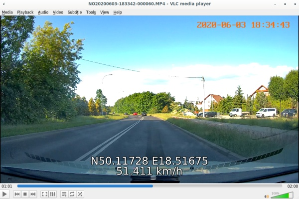

# 70mai Dash Cam Pro MP4 GPS Extractor

This little toolkit (dedicated to use on unix systems) provides ability to
extract GPS location data from MP4 files recorded by 70mai Smart Dash Cam Pro.



# Usage

## Single file use

Build original file `maigps.c` made by freezer52000.

```
gcc maigps.c -o maigps
```

and use it

```
./maigps NO20200603-195018-000082.MP4 > NO20200603-195018-000082.MP4.srt
```

You may also output data to terminal.

## Whole directory processing

Build forked source:

```
gcc maigpsmass.c -o maigpsmass
```

and run it choosing directory with your recordings. Tool will create
new files with same name appending `.srt` extension to filename.

```
./maigpsmass targetDirectory/
```
or
```
~/apps/maigpsmass .
```

# Thanks

* freezer52000 via [dashcamtalk.com](https://dashcamtalk.com/forum/threads/gps-speed-location-till-the-end-of-may-19.38831/post-496592)
* me
